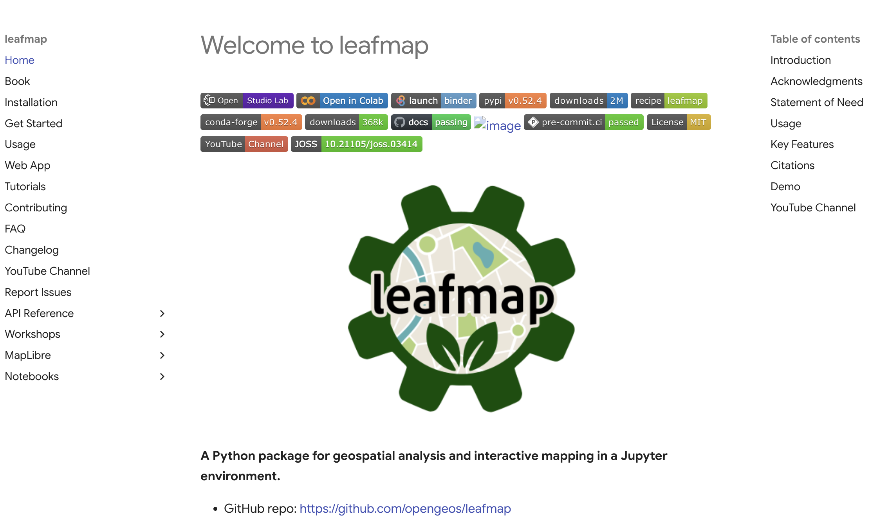
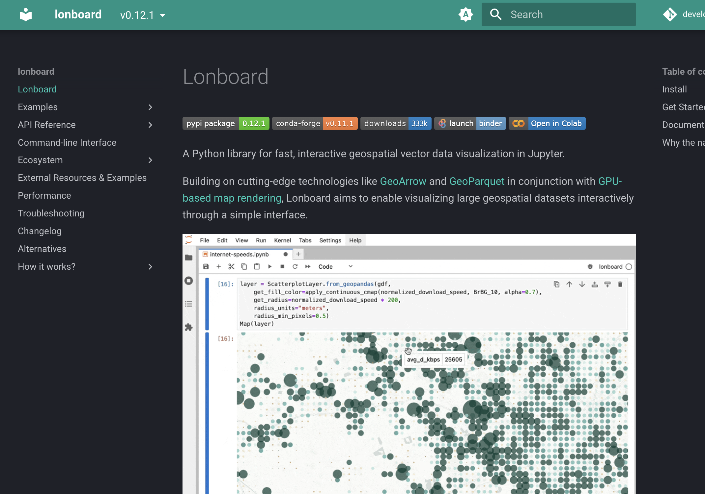
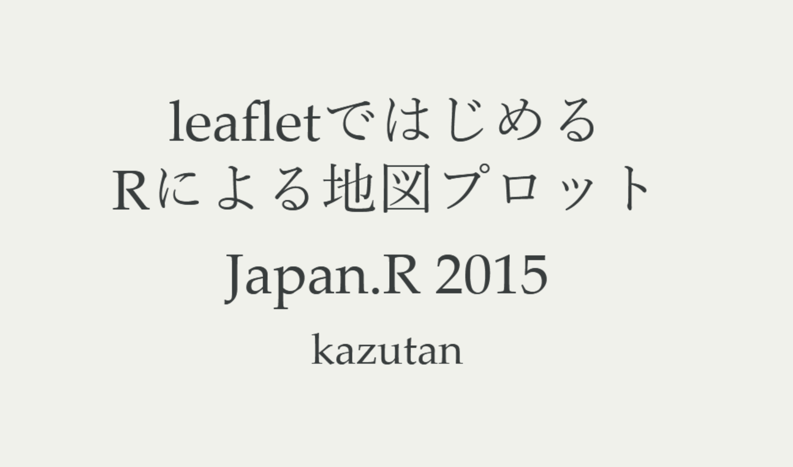
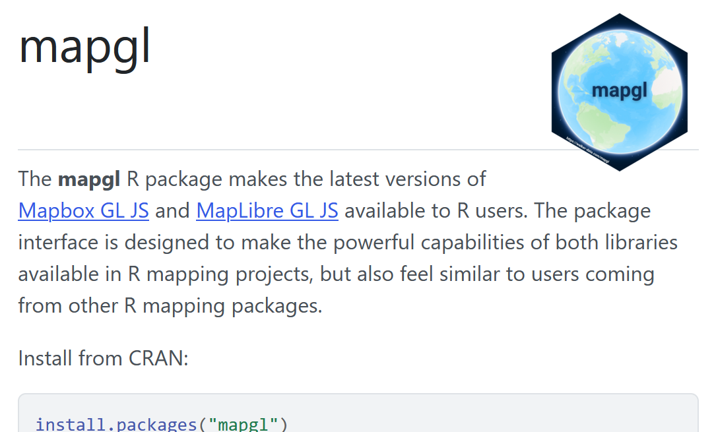
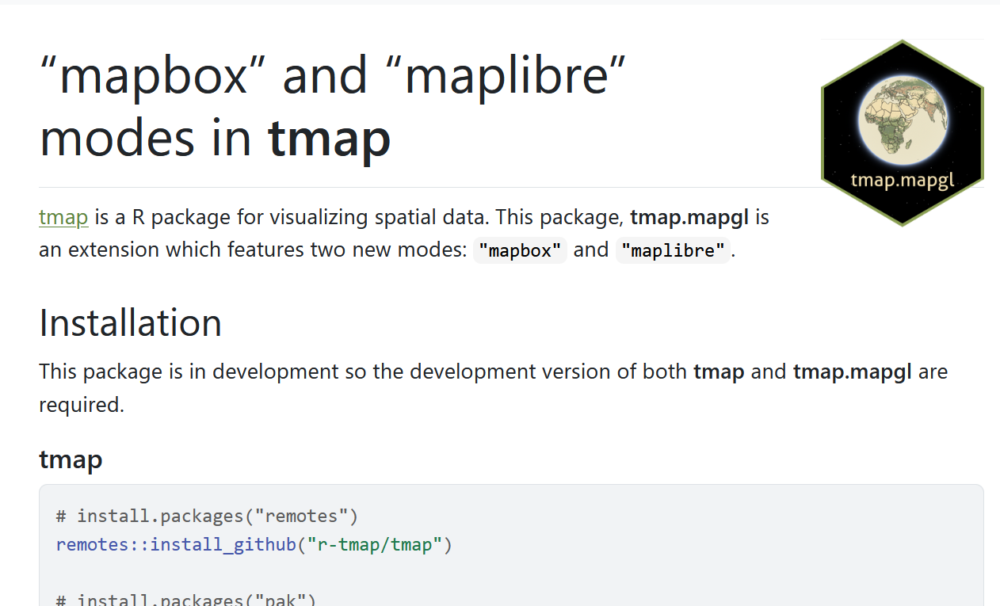

```{r setup}
#| include: false
knitr::opts_chunk$set(echo = TRUE)
```

## ドーモ！

::: columns
::: {.column width="30%"}
{fig-align="center"}
:::

::: {.column width="70%"}

湯谷啓明

- 株式会社 MIERUNE 所属
- GIS エンジニア見習いになって半年
- 好きな言語：R、忍殺語

:::
:::

## 今日話すこと

- R で MapLibre の地図を作る方法
- 具体的なパッケージの使い方よりは「こんなのもあるよ」という紹介
- R ユーザーの人もそうじゃない人も気楽に聞いてください

## 今日話さないこと（お詫び）

- ストーリーマップ機能
- Turf.jsによるクライアントサイドでの処理

Shiny（R のウェブアプリケーションフレームワーク）前提の話になって、ちょっとマニアックすぎるので省略。
気になる人は懇親会で話しましょう！

## ちなみに Python の場合

[](https://leafmap.org/)

## ちなみに Python の場合

[](https://developmentseed.org/lonboard/latest/)

## Rでインタラクティブな地図といえば？

::: {.fragment}

[](https://rpubs.com/kazutan/leaflet_slide)

:::

## Rでインタラクティブな地図といえば

- leaflet パッケージ先生
- 10年前から変わらない存在感

::: {.incremental}
- でも、そろそろ MapLibre を使いたくないですか？？
:::

## mapgl パッケージ

[](https://walker-data.com/mapgl/index.html)

## mapgl パッケージ

- GIS データをインタラクティブに可視化するための R パッケージ
- MapLibre GL JS か Mapbox GL JS が選べる

## 基本的な使い方

- `maplibre()`: MapLibre GL JS で地図を表示
- `mapboxgl()`: Mapbox GL JS で地図を表示
    - API キーが必要

## 地図を表示

```{r}
#| include: false

# compare() が衝突するので先に呼び出しておく
library(terra)

library(mapgl)
```

```{r}
maplibre()
```

## Globe projection

```{r}
maplibre() |>
  set_projection("globe")
```

## 中心とズームレベルを指定

```{r}
#| output-location: slide
#| code-line-numbers: "2-3"
maplibre(
  center = c(141.359719, 43.071776),
  zoom = 13
)
```

## スタイルを指定

```{r}
#| output-location: slide
#| code-line-numbers: "1-3,6"
# 地理院地図のスタイル
gsi_style <-
  "https://gsi-cyberjapan.github.io/gsivectortile-mapbox-gl-js/pale.json"

maplibre(
  style = gsi_style,
  center = c(141.359719, 43.071776),
  zoom = 13
)
```

## 傾けてみる

```{r}
#| output-location: slide
#| code-line-numbers: "5-6"
maplibre(
  style = gsi_style,
  center = c(141.359719, 43.071776),
  zoom = 16,
  pitch = 75,
  bearing = 136,
)
```

## 動かしてみる

```{r}
#| output-location: slide
maplibre() |>
  set_projection("globe") |>
  fly_to(
    center = c(141.359719, 43.071776),
    zoom = 18,
    pitch = 75,
    bearing = 136
  )
```

（リロードしないと動かないかも...）

## データを表示する

- Rで生成したデータを表示する場合は、`sf` 形式で渡す
- それ以外のデータソース（GeoJSON とか PMTiles とか）も使える

::: {.incremental}
- ただ、ちょっとコードがお手軽じゃないかも...
:::


## データを表示する

- 国土数値情報からダウンロードした都道府県地価調査（2025年）のデータ

```{r}
#| include: false
data <- kokudosuuchi::readKSJData("data/L02-25_01_GML.zip")$`L02-25_01`

map <- maplibre(
  style = gsi_style,
  center = c(141.359719, 43.071776),
  zoom = 6
)
```

```{r}
#| output-location: slide
map |>
  add_circle_layer(
    id = "chika",
    source = data,
    circle_radius = 8,
    circle_opacity = 0.7
  )
```

## データを表示する

- 色が欲しい...

## 色のマッピングをつくる

- `L02_006` が地価が入っているカラム

```{r}
pal <- interpolate_palette(
  data = data,
  column = "L02_006",
  method = "quantile",
  n = 4,
  palette = scales::viridis_pal(option = "F", direction = -1)
)
```

## 色のマッピングを指定する

```{r}
#| output-location: slide
#| code-line-numbers: "7"
map |>
  add_circle_layer(
    id = "chika",
    source = data,
    circle_radius = 8,
    circle_opacity = 0.7,
    circle_color = pal$expression
  )
```

## 色のマッピングを指定する

- 凡例が欲しい...

## 凡例を付ける

```{r}
#| include: false
map_with_circle <- map |>
  add_circle_layer(
    id = "chika",
    source = data,
    circle_radius = 8,
    circle_opacity = 0.7,
    circle_color = pal$expression
  )
```

```{r}
#| output-location: slide
map_with_circle |>
  add_continuous_legend(
    "地価 [円]",
    values = get_legend_labels(pal, digits = 0),
    colors = get_legend_colors(pal)
  )
```

## 凡例を付ける

- ポップアップで実際の値を確認したい...

## `tooltip`（マウスオーバーで表示）

```{r}
#| include: false
legend <- \(x) {
  add_continuous_legend(
    x,
    "地価 [円]",
    values = get_legend_labels(pal, digits = 0),
    colors = get_legend_colors(pal)
  )
}
```

```{r}
#| output-location: slide
#| code-line-numbers: "8"
map |>
  add_circle_layer(
    id = "chika",
    source = data,
    circle_radius = 8,
    circle_opacity = 0.7,
    circle_color = pal$expression,
    tooltip = "L02_006"
  ) |>
  legend()
```

## `popup`（クリックで表示）

```{r}
#| output-location: slide
#| code-line-numbers: "8"
map |>
  add_circle_layer(
    id = "chika",
    source = data,
    circle_radius = 8,
    circle_opacity = 0.7,
    circle_color = pal$expression,
    popup = "L02_006"
  ) |>
  legend()
```

## レイヤーの種類

- polygon
- line
- circle
- symbol
- heatmap
- fill-extrusion（3D）
- raster
- marker

## ラスター

- 逆距離荷重で地価を補間したラスターを作成

```{r}
# terra の形式に変換
v <- vect(data)
# 点を含む範囲の空のラスターを作成
tmpl <- rast(ext(v), ncol = 400, nrow = 400, crs = crs(v))
# ラスターの各ピクセルに対して値を補間
r_idw <- interpIDW(tmpl, v, field = "L02_006", radius = 0.3)
# 見やすくするために対数を取っておく
r_idw_log10 <- log10(r_idw)
```

## ラスター

```{r}
#| output-location: slide
map |>
  add_image_source(
    id = "idw",
    data = r_idw_log10
  ) |>
  add_raster_layer(
    id = "idw_layer",
    source = "idw",
    raster_opacity = 0.7
  )
```

## PMTiles

- Overture Maps の建物データを表示してみる

```{r}
#| include: false
map <- maplibre(
  center = c(141.359719, 43.071776),
  zoom = 13
)
```

```{r}
#| output-location: slide
map |>
  add_pmtiles_source(
    id = "overturemaps",
    url = "https://overturemaps-tiles-us-west-2-beta.s3.amazonaws.com/2025-06-25/buildings.pmtiles"
  ) |>
  add_fill_layer(
    id = "overturemaps-layer",
    source = "overturemaps",
    source_layer = "building",
    fill_color = "red",
    fill_opacity = 0.3
  )
```

## 左右比較

```{r}
#| output-location: slide
m1 <- maplibre(
  center = c(141.359719, 43.071776),
  zoom = 13
)
m2 <- maplibre(
  style = gsi_style,
  center = c(141.359719, 43.071776),
  zoom = 13
)
compare(m1, m2, mode = "sync")
```

## mapgl パッケージの良いところ

- MapLibre GL JSでできることはけっこうできる
- コードも、MapLibre GL JS と似た API になっているので、MapLibre GL JS を使ったことがある人なら直感的に使える
- Shiny と組み合わせるといろいろ面白いことできそう

## mapgl パッケージの悪いところ

- API が低レベルなので、コードが長くなりがち
- 「これなら普通に JavaScript 書いた方がいいのでは...？」と思うこともけっこうある

## 例:さっきの色の指定

::: {style="font-size: 50%;"}

```{r}
jsonlite::toJSON(pal$expression, pretty = TRUE, auto_unbox = TRUE)
```

:::

## 例:さっきの色の指定

- MapLibre のスタイルをそのまま R で書いてる感じ
- さすがに生すぎるのでは...？

## tmap.mapgl パッケージ

[](https://r-tmap.github.io/tmap.mapgl/)

## tmap.mapgl パッケージ

- GIS データを可視化するパッケージ・tmap のバックエンドとして mapgl を使う
- つい最近 CRAN に登録された。

## tmap.mapgl パッケージ

```{r}
#| include: false
library(tmap)
library(tmap.mapgl)
```

```{r}
#| output-location: slide
tmap_mode("maplibre")

tm_shape(data) +
  tm_symbols(
    size = 0.6,
    fill = "L02_006",
    fill_alpha = 0.5,
    fill.scale = tm_scale_continuous_log10(
      values = "-matplotlib.magma"
    )
  )
```

## 比較：さっきまでのコード

::: {style="font-size: 50%;"}

```r
pal <- interpolate_palette(
  data = data,
  column = "L02_006", # カラム名
  method = "quantile",
  n = 4,
  palette = scales::viridis_pal(option = "F", direction = -1)
)

map |>
  add_circle_layer(
    id = "chika",
    source = data,
    circle_radius = 8,
    circle_opacity = 0.7,
    circle_color = pal$expression
  ) |>
  add_continuous_legend(
    "地価 [円]",
    values = get_legend_labels(pal, digits = 0),
    colors = get_legend_colors(pal)
  )
```

:::

## tmap.mapgl パッケージ

- mapgl パッケージを自分で使うよりも圧倒的に短く書ける
- 対応していないレイヤーの種類もある（ヒートマップとか）
- こんな感じで、mapgl パッケージは直接使うものではなく、使いやすくラップしてくれているパッケージ越しに使うのが正解なのかも

## 実際、使うことはあるのか？

- 正直、leaflet パッケージの方が便利
  - プラグインが豊富
  - まあまあ使いやすいインターフェース
- 3D表示をしたい時は mapgl が便利かも
- 重いデータの表示も mapgl が上かも

## まとめ

- R から MapLibre を使いたい時は mapgl パッケージ
- mapgl パッケージを生で使うより、tmap.mapgl パッケージを使うと便利
- 今後に期待！
